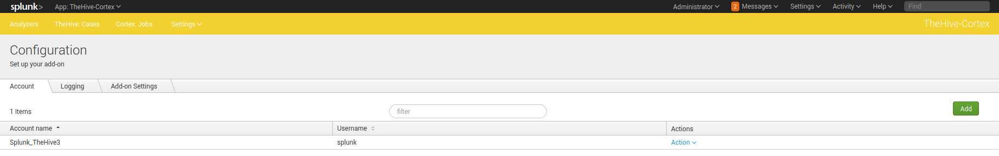
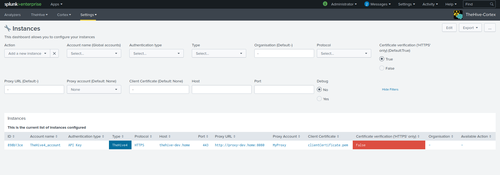
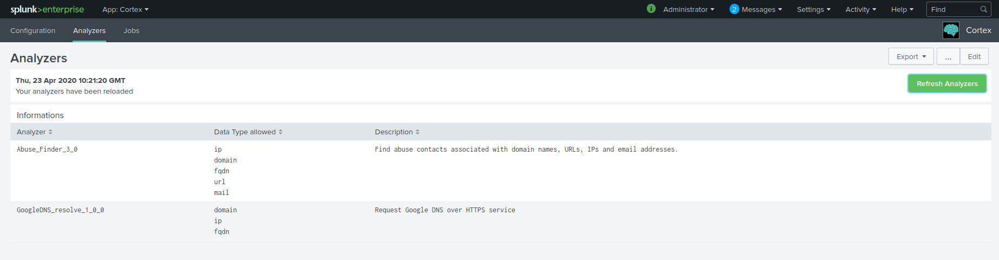
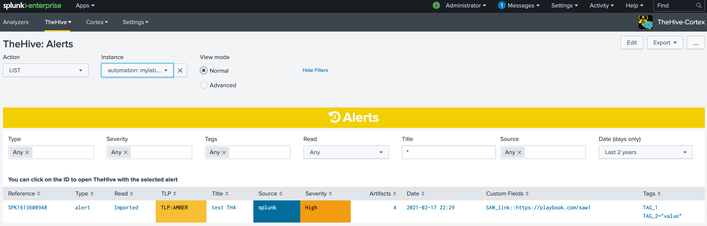
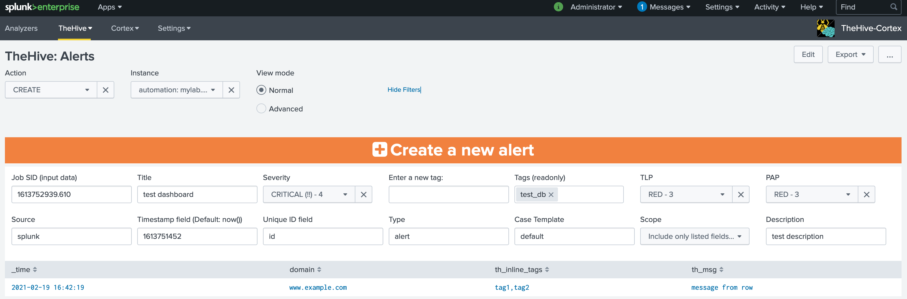
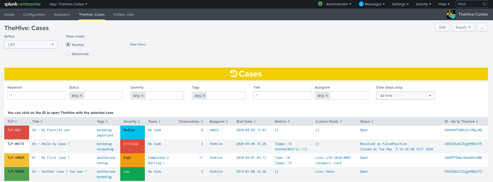
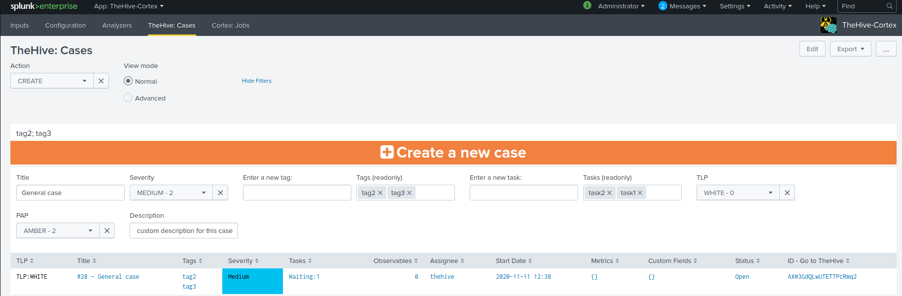
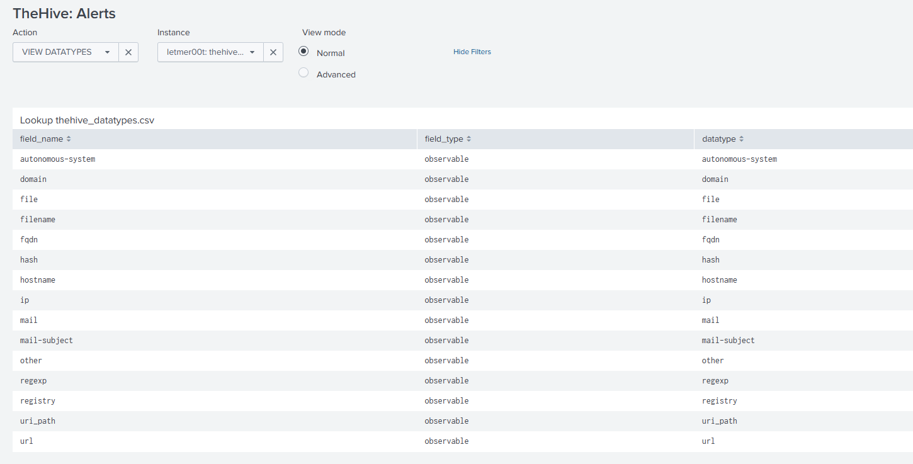
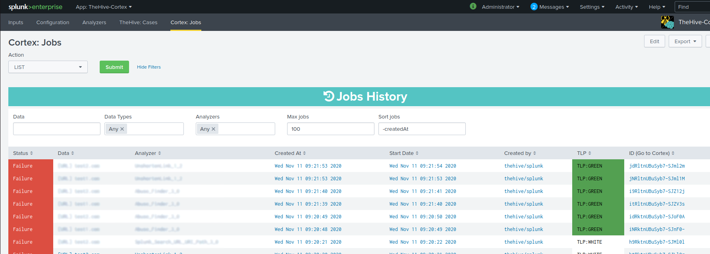

  

# Table of content

- [Table of content](#table-of-content)
- [Introduction](#introduction)
- [What is TheHive/Cortex ?](#what-is-thehivecortex-)
- [Use Cases](#use-cases)
- [Installation](#installation)
	- [Requirements](#requirements)
	- [Configuration](#configuration)
		- [Accounts](#accounts)
		- [TheHive/Cortex instances](#thehivecortex-instances)
		- [Logging](#logging)
	- [Refreshing the available analyzers](#refreshing-the-available-analyzers)
- [Usage](#usage)
	- ["TheHive: Alerts" dashboard](#thehive-alerts-dashboard)
		- [TheHive Alert History](#thehive-alert-history)
		- [Create a new alert](#create-a-new-alert)
	- ["TheHive: Cases" dashboard](#thehive-cases-dashboard)
		- [TheHive Case History](#thehive-case-history)
		- [Create a new case](#create-a-new-case)
		- [View datatypes](#view-datatypes)
	- ["Cortex: Jobs" dashboard](#cortex-jobs-dashboard)
		- [Cortex History](#cortex-history)
		- [Run new tasks](#run-new-tasks)
	- [Commands in searches](#commands-in-searches)
	- [Everything you need to know about the custom alert actions or adaptative responses](#everything-you-need-to-know-about-the-custom-alert-actions-or-adaptative-responses)
- [Support](#support)
- [Credits](#credits)
- [Licence](#licence)

# Introduction

This TA allows to **add interaction features** between [TheHive or Cortex (StrangeBee)](https://www.strangebee.com/) and Splunk. It allows to retrieve all kind of information from TheHive/Cortex and to perform actions on these instances using Splunk, from a search or from a predefined dashboard.

This TA is supporting only TheHive 5. For having an app supporting TheHive 3 or 4, please check the oldest releases. It's also supporting the Cortex 3 version.

> **Note**:
It's working using Python3 with the official thehive4py and cortex4api library included. Please note that few modifications were performed to improve the features of those libraries and are shared with the original repositories owners in order to merge them in a future version
**A support was added to use Python 3.7**. As Splunk is using at most Python 3.7.11 at this time of writing, we added the support to the original library. This is not an official library, it's a syntactically-revised version.

# What is TheHive/Cortex ?

If you need more information about TheHive/Cortex project, please [follow this link](https://www.strangebee.com/).
You can find the related [TheHive Project here](https://github.com/TheHive-Project) (including Cortex).

# Use Cases

The objective is to interface a SIEM tool such as Splunk in order to be able to perform automated tasks on observables/IOCs or TTPs.
This TA has been designed in such a way that :

- You can pull events periodically from TheHive about the different cases/alerts that were created or updated
- You can create new alert or case from Splunk in TheHive using the power of Splunk whether in a search or in a predefined dashboard.
- You can run a function in TheHive from an alert action
- You can interface Splunk Enterprise Security with TheHive
- You can retrieve information from Cortex about the different jobs that are being performed on the scanners.
- You can run new tasks from Splunk in Cortex using the power of Splunk whether in a search or a predefined dashboard.

# Installation

## Requirements

This application contains all the python libraries to work autonomously.

**However**, predefined dashboards of the application requires the installation of this application : [Status Indicator - Custom Visualization](https://splunkbase.splunk.com/app/3119/)

You should create a specific user and organization in your TheHive/Cortex instances to interact with Splunk.

> ⚠️ If you were using an old application (such as v2.3.1) and wants to migrate to the last major version (v3.x.x), there is a change with the way how instances are stored into Splunk. It's not using anymore a KVStore but a CSV lookup to do so. Please, follow the below procedure

Before the migration, you should backup your instances information using a:

- `| inputlookup thehive_cortex_instances | outputlookup thehive_cortex_instances_bk.csv`

in another application such as "search"), then migrate and finally restore the backup using a:

- `| thehive_cortex_instances_bk.csv | outputlookup thehive_cortex_instances`

## Configuration

Before using the application, you need to set up your environment settings. Please note that this application is using a list of accounts and instances, meaning you can configure several instances of TheHive/Cortex in the same app and with different accounts.

### Accounts

You have to set up your accounts/instances configuration.
An account is used to authenticate to one instance. You have to add every account you need to use and store the API Key as the password (**username/password authentication is only supported for TheHive, not Cortex, we recommand you to use an API key**)

1. Go to the **TheHive/Cortex application > Settings > Configuration** (in the navigation bar)
2. Under **Accounts**, you need to add any account you want to use with TheHive/Cortex

- **Account name**: The name of the account, it will be reused to link an account to an instance.  
- **Username**: The username of this account. For now, it's not used but we recommand you to keep the same name as you have on your instance (TheHive or Cortex)
- **Password**: The password field must be filled with **a valid API key** to use for authentification

*This image is an example of one registered account named "TheHive5_Cloud"*

### TheHive/Cortex instances

Once you've done that, you can configure all your instances. An instance is an endpoint representing a TheHive or Cortex instance.

1. Go to the **TheHive/Cortex application > Settings > Instances** (in the navigation bar)
2. On this dashboard, you need to add every instance you want to use. To do so, select the "**Add a new instance**" as action and fill these fields:

- **Account name (Global accounts)**: This is the name of the account to use that you added under "Accounts". It will list you all available accounts you have previously set up.
- **Authentication type**: Authentication type for your instance. Password is working only with TheHive but we recommand you to use an API key everytime
- **Type**: Type of your instance (TheHive (v3 or v4) or Cortex (v3)).
- **Organisation**: The name of the organisation against which api calls will be run. Default to "-" meaning None.
- **Proxy URL**: A string that indicates what is the proxy URL to use for this instance if there is any. You can specify http/https if you want but the same value will be used for both protocols. Default to "-" meaning None
- **Proxy account**: This is the name of the account to use for the proxy authentication (only basic) that you added under "Accounts". It will list you all available accounts you have previously set up. Default to "None".
- **Client Certificate**: Filename of you client certificate if you need one. This certificate must be placed under "\$APP_FOLDER\$/local" and you just have to set the name of the file here. This certificate will be used during the proxy authentication. Default to "-" meaning None. In the case you would like to do mTLS (Mutual TLS), you can add the public AND private key into the same file and point this file with this field.
- **Host**: Host of your instance (hostname or IP).
- **Port**: Port used by your instance (Default:9000 for TheHive, 9001 for Cortex).
- **URI**: Indicates what is the URI based for your instance. By default, TheHive/Cortex is installed at the root of the server so the URI would be "/". If you are using a Cloud instance, you may have to specify the URI used by your cloud instance. For example, if your TheHive instance is accessible with this URL : "https://my-cloud-website.com:443/mythehiveinstance", then you should specify in the URI field "/mythehiveinstance".

> **Note**: Protocol used by default is HTTPS and can't be modified. Moreover, the certificate verification is mandatory and set to True (below screenshot is not up to date). If you use an HTTPS connection with a self-signed certificate of a custom certificate authority, you must add your trusted certificate to the "certifi" library. To do so, append your certificate under "\$APP_FOLDER\$/bin/ta_thehive_cortex/aob_py3/certifi/cacert.pem"

*This image shows the addition of a new instance (partially filled fields) by specifying an account name defined beforehand.*

On the above example, you can see a list of defined instances:

- The 1st example could be an on-premise instance without any security check
- The 2nd example could be an on-premise instance with a client certificate to use for the authentication to a proxy
- The 3rd example could be a Cloud instance with a custom URI to access the TheHive application but without any certificate check
- The 4th example could be a Cloud instance with a custom URI to access the TheHive application, to a certain organisation and ensuring the certificate check

### Logging

You can enable a "debug" logging mode (under **Configuration**) to have more information in searches/logs.
By default, all logging files are created under `$SPLUNK_HOME/var/log/splunk/`

You will be able to have these logs in your search.log too.

## Refreshing the available analyzers

Once you've configured your Cortex instance, the list of analyzers will be loaded in Splunk.
Analyzers must be refreshed using the related dashboard by using the "REFRESH" mode.
Once you've refreshed your analyzers, they will be available in the Cortex dashboard in order to create new jobs.

**Note**: Only enabled analyzers will be loaded

These information are stored in Splunk in order to have a mapping between available analyzers and data types.

# Usage

Once the application is configured and the analyzers are loaded, you have several options for interfacing with TheHive/Cortex.

## "TheHive: Alerts" dashboard

The application integrates a preconfigured dashboard with searches allowing you to easily interface with TheHive and manage TheHive alerts.  
This dasboard is also related to alert action "TheHive - Create a new alert"

### TheHive Alert History

You can retrieve the history of alerts in TheHive using the action "LIST".
For each alert, you can see :

- **Alert ID**: ID of the alert
- **Title**: Title of the alert
- **Read**: the status of the alert on TheHive (unread, read, imported)
- **TLP**: TLP of the alert
- **Source**: the set source of the alert (default is "splunk")
- **Severity**: Severity of the alert
- **TTPs**: TTPs of the case (just the number but you can retrieve the full detail in the logs)
- **Observables**: Number of observables for the case (just the number but you can retrieve the full detail in the logs)
- **Date**: date & time of the alert
- **Custom Fields**: custom fields of the alert
- **Tags**: Tags of the alert

You can set filters for the history:

- **Type**: type of alerts
- **Severity**: Severity of alerts
- **Tags**: Tags of alerts
- **Read**: read status of alerts
- **Title**: Title of alerts
- **Source**: source of alerts
- **Date**: Creation date of alerts

### Create a new alert

The standard way is to use the alert action "TheHive - Create a new alert" in your saved Splunk alerts or correlation searches.
You can manually create a new alert from Splunk using the "CREATE" action and a valid SID of a Splunk search.

You have to specify some inputs:

- **Job SID (input data)**: SID of a search (you can retrieve SIDs from Splunk > Activity > Jobs)
- **Title**: Title for this new alert
- **Severity**: Severity for this new alert
- **Tags**: Tags for this new alert (they are added by specifiying values in the "Enter a new tag" input)
- **TLP**: TLP for this new alert
- **PAP**: PAP for this new alert
- **Source**: source of this alert (you can provide a field name to set this value from results)
- **Timestamp field**: field containing a valid EPOCH timestamp (10-digit for s;13-digit for ms) - if not present, default to now()
- **Unique ID field**: the unique reference for this alert. If a field name is provided, it is used to group results rows in several alerts - default is SPK+now()
- **Type**: type of alert (default is "alert")
- **Case Template**: Case template to use by default when importing alert into a case
- **Scope**: a swithc to include all fields from result set (as type "other") or only field names listed in lookup table "thehive_datatypes.csv"
- **Description**: Description for this new alert

The search will retrieve the results from SID and create the new alert. You can check the new alert in TheHive Alert History

## "TheHive: Cases" dashboard

The application integrates a preconfigured dashboard with searches allowing you to easily interface with TheHive.

### TheHive Case History

You can retrieve the history of cases in TheHive using the action "LIST".
For each job, you can see :

- **TLP**: TLP of the case
- **Title**: Title of the case
- **Tags**: Tags of the case
- **Severity**: Severity of the case
- **Tasks**: Tasks of the case by status
- **TTPs**: TTPs of the case (just the number but you can retrieve the full detail in the logs)
- **Observables**: Number of observables for the case (just the number but you can retrieve the full detail in the logs)
- **Assignee**: Current assignee for the case
- **Start Date**: Date and time for the start of the case
- **Custom Fields**: Current custom fields for the case
- **Status**: Current status for the case with detailed resolution
- **ID**: ID of the job

**Note: You can click on the ID to view the result of the job directly on TheHive** (you should be authenticated to TheHive)

You can set filters for the history:

- **Keyword**: A keyword to search on
- **Status**: Status of the case
- **Severity**: Severity of the case
- **Tags**: Tags of the case
- **Title**: Title of the case
- **Assignee**: Assignee of the case
- **Date**: Creation date of the case

### Create a new case

The standard way is to use the alert action "TheHive - Create a new case" in your saved Splunk alerts or correlation searches.
You can manually create a new case from Splunk using the "CREATE" action and a valid SID of a Splunk search.

You have to specify some inputs:

- **Job SID (input data)**: SID of a search (you can retrieve SIDs from Splunk > Activity > Jobs)
- **Title**: Title for this new case
- **Severity**: Severity for this new case
- **Tags**: Tags for this new case (they are added by specifiying values in the "Enter a new tag" input)
- **TLP**: TLP for this new case
- **PAP**: PAP for this new case
- **Source**: source of this case (you can provide a field name to set this value from results)
- **Timestamp field**: field containing a valid EPOCH timestamp (10-digit for s;13-digit for ms) - if not present, default to now()
- **Unique ID field**: the unique reference for this case. If a field name is provided, it is used to group results rows in several alerts
- **Case Template**: Case template to use by default when importing alert into a case
- **Scope**: a swithc to include all fields from result set (as type "other") or only field names listed in lookup table "thehive_datatypes.csv"

The search will create the new case accordingly

### View datatypes

Alert action "TheHive - Create a new alert" uses a lookup table to identify supported fields as TheHive datatypes or custom fields.
If this lookup table is missing, first call of alert action will attempt to create it with default list of supported data types.

For every event that will be processed by a custom alert action, the script will try to determine which fields are observables and for that it will rely on this table accordingly. For instance, if you event has a field named "fqdn", it will consider the value of the field as a "fqdn" observable. You can update your list with your own fields accordingly by updating the lookup.

> For custom fields, we are directly retrieving the custom fields from the TheHive instance and it's working the same meaning that if you have a custom field named "my_custom_field", then you just need to have a field named "my_custom_field" with the value you want to set for this custom field.

## "Cortex: Jobs" dashboard

The application integrates a preconfigured dashboard with searches allowing you to easily interface with Cortex.

### Cortex History

You can retrieve the history of jobs in Cortex using the action "LIST".
For each job, you can see :

- **Status**: Current status for the job
- **Data**: Data and datatype for the job
- **Analyzer**: Analyzer used for the job
- **Created At**: Date and time for the creation of the job
- **Start Date**: Date and time for the start of the job (a created job could not be executed immediately)
- **Created by**: User/Organization used to created the job
- **TLP**: TLP specified for the job
- **ID**: ID of the job

**Note: You can click on the ID to view the result of the job directly on Cortex** (you should be authenticated to Cortex)

You can set filters for the history:

- **Data**: filtering the "data" field, regular expressions are not working, it must be the exact match string
- **Data Types**: filtering on the "data types", several values can be specified
- **Analyzers**: filtering on the "analyzers", several values can be specified

### Run new tasks

You can start new analyses from Splunk using the "RUN" action.

You have to specify some inputs:

- **Data**: data you want to analyze separated by a semicolon, they must be of the same data type
- **Data type**: corresponding to the data type of data
- **TLP**: TLP level to use for this analysis
- **PAP**  PAP level to use for this analysis
- **Analyzers**: analyzers to use, if "any" is set, it will use any enabled analyzers for the given data type

The search will execute all jobs (one data with one analyzer) and return information such as the job ID.

## Commands in searches

You can use new commands within your searches. For more information, please [read the associated documentation](https://github.com/LetMeR00t/TA-cortex/tree/main/docs/commands.md).

## Everything you need to know about the custom alert actions or adaptative responses

For more information, please [read the associated documentation](https://github.com/LetMeR00t/TA-cortex/tree/main/docs/alert_actions_and_adaptive_response.md).

# Support

Please [open an issue on GitHub](https://github.com/LetMeR00t/TA-cortex/issues) if you'd like to report a bug or request a feature.

# Credits

This app was inspired by [this Splunk app](https://splunkbase.splunk.com/app/4380/)

# Licence

This app TA_cortex is licensed under the GNU Lesser General Public License v3.0.
