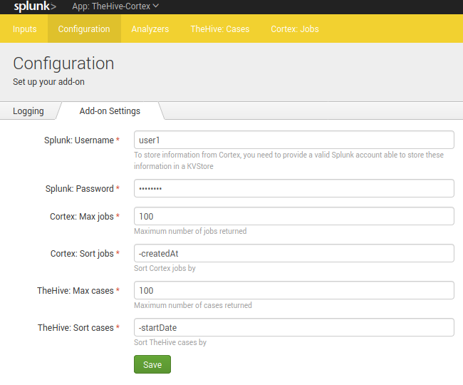
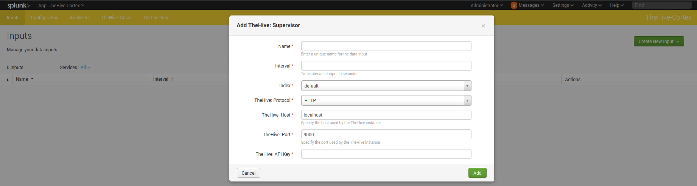

# Table of content
* [ Introduction ](#introduction)  
* [ What is TheHive/Cortex ? ](#what-is-thehivecortex-)
* [ Use Cases ](#use-cases)
* [ Installation ](#installation)
	* [ Requirements ](#requirements)
	* [ Configuration ](#configuration)
		* [ Add-on Settings ](#add-on-settings)
		* [ TheHive ](#thehive)
		* [ Cortex ](#cortex)
		* [ Logging ](#logging)
	* [ Refreshing the available analyzers ](#refreshing-the-available-analyzers)
* [ Usage ](#usage)
	* ["TheHive: Cases" dashboard](#thehive-cases-dashboard)
		* [ TheHive History ](#thehive-history)
		* [ Create a new case ](#create-a-new-case)
	* [ "Cortex: Jobs" dashboard ](#cortex-jobs-dashboard)
		* [ Cortex History ](#cortex-history)
		* [ Run new tasks ](#run-new-tasks)
	* [ Commands in searches ](#commands-in-searches)
* [ Support ](#support)
* [ Credits ](#credits)
* [ Licence ](#licence)

# Introduction
This TA allows to **add interaction features** between [TheHive or Cortex (TheHive project)](https://thehive-project.org/) and Splunk. It allows to retrieve all cases/jobs information from TheHive/Cortex and to perform actions on these instances using Splunk, from a search or from a predefined dashboard.
All data types work with the exception of "file" because Splunk does not allow to send a file easily.

**Note**:
It's working using Python3 with the official cortex4api library included.
**A support was added to use Python2**. This is not an official library, it's a syntactically-revised version.
This application is not available for Splunk version<8.0 due to modular input issue not resolved yet (if you are interested, you can take a look 😉) 
In other words, **it's working for Splunk 8.0 and higher versions**.

# What is TheHive/Cortex ?
If you need more information about TheHive/Cortex project, please [follow this link](https://thehive-project.org/).
You can find the related [TheHive Github here](https://github.com/TheHive-Project/TheHive) and [Cortex Github here](https://github.com/TheHive-Project/Cortex) .

# Use Cases
The objective is to interface a SIEM tool such as Splunk in order to be able to perform automated tasks on observables/IOCs.
This TA has been designed in such a way that :
* You can retrieve information from TheHive about the different cases that were created
* You can retrieve information from Cortex about the different jobs that are being performed on the scanners.
* You can create new case from Splunk in TheHive using the power of Splunk whether in a search or in a predefined dashboard.
* You can run new tasks from Splunk in Cortex using the power of Splunk whether in a search or a predefined dashboard.

# Installation
## Requirements
This application contains all the python libraries to work autonomously.

**However**, predefined dashboards of the application requires the installation of this application : [Status Indicator - Custom Visualization](https://splunkbase.splunk.com/app/3119/)

You should create a specific user and organization in your TheHive/Cortex instances to interact with Splunk.

## Configuration

### Add-on settings
First thing you have to do is to configure a valid Splunk account.
When you add a new Cortex instance, analyzers will be recovered and need to be stored on a KV Store. To do that, the script need to have access to Splunk to perform the storage.
We advise you to use a specific local account for this application (not an admin one)
1. Go to the **TheHive/Cortex application > Configuration** (in the navigation bar)
2. Under **Add-on Settings**, You need to fill the following settings:
* Splunk: Username
* Splunk: Password

*Note*: This will be probably removed in a future version of the application and use instead a CSV lookup.
### TheHive
Once you've set the add-on settings, you must configure your TheHive instance :

1. Go to the **TheHive/Cortex application > Inputs** (in the navigation bar)
2. Click on the right on **Create New Input > TheHive: Supervisor**
3. You need to specify the following settings :

* **Name**: Choose a custom name for your input
* **Interval**: An integer representing the interval time in seconds for the supervisor script. This script will be executed to check if the connection is OK.
* **Index**: Choose an index in which the supervisor will log the result of the connection. The sourcetype used by this script is **"thehive:supervisor"**.
* **TheHive: Protocol**: Choose "http" or "https"
* **TheHive: Host**: Hostname/IP of the TheHive instance
* **TheHive: Port**: Port used by TheHive
* **TheHive: API Key**: Corresponds to the API key used by the user/organization to be used (the user/organization will be determined automatically by TheHive)

*Note*: You can create several instances of TheHive/Cortex but it's not well supported by the entire application for the moment. Please define only one instance of TheHive for the moment.

### Cortex
Once you've set the add-on settings, you must configure your Cortex instance :

1. Go to the **TheHive/Cortex application > Inputs** (in the navigation bar)
2. Click on the right on **Create New Input > Cortex: Supervisor**
3. You need to specify the following settings :

* **Name**: Choose a custom name for your input
* **Interval**: An integer representing the interval time in seconds for the supervisor script. This script will be executed to check if the connection is OK and recover the list of analyzers (to keep it up to date).
* **Index**: Choose an index in which the supervisor will log the result of the connection. The sourcetype used by this script is **"cortex:supervisor"**.
* **Cortex: Protocol**: Choose "http" or "https"
* **Cortex: Host**: Hostname/IP of the Cortex instance
* **Cortex: Port**: Port used by Cortex
* **Cortex: API Key**: Corresponds to the API key used by the user/organization to be used (the user/organization will be determined automatically by Cortex)

*Note*: You can create several instances of TheHive/Cortex but it's not well supported by the entire application for the moment. Please define only one instance of Cortex for the moment.

### Logging

You can enable a "debug" logging mode (under **Configuration**) to have more information in searches/logs.
By default, a logging file is created under `$SPLUNK_HOME/var/log/splunk/` with the file name starting with "command_"

You will be able to have these logs in your search.log.

## Refreshing the available analyzers
Once you've configured your Cortex input, the list of analyzers will be loaded in Splunk.
Each time the supervisor script is checking the connection, it will recover the list of analyzers to keep it up to date.

**Note**: Only enabled analyzers will be loaded

These information are stored in Splunk in order to have a mapping between available analyzers and data types.

# Usage
Once the application is configured and the analyzers are loaded, you have several options for interfacing with TheHive/Cortex.
## "TheHive: Cases" dashboard
The application integrates a preconfigured dashboard with searches allowing you to easily interface with TheHive.

### TheHive History
You can retrieve the history of cases in TheHive using the action "LIST".
For each job, you can see :
* **TLP**: TLP of the case
* **Title**: Title of the case
* **Tags**: Tags of the case
* **Severity**: Severity of the case
* **Tasks**: Tasks of the case by status
* **Observables**: Number of observables for the case
* **Assignee**: Current assignee for the case
* **Start Date**: Date and time for the start of the case
* **Metrics**: Current metrics for the case
* **Custom Fields**: Current custom fields for the case
* **Status**: Current status for the case with detailed resolution
* **ID**: ID of the job

**Note: You can click on the ID to view the result of the job directly on TheHive** (you should be authenticated to TheHive)

You can set filters for the history:
* **Keyword**: A keyword to search on
* **Status**: Status of the case
* **Severity**: Severity of the case
* **Tags**: Tags of the case
* **Title**: Title of the case
* **Assignee**: Assignee of the case
* **Date**: Creation date of the case

### Create a new case
You can create a new case from Splunk using the "CREATE" action.

You have to specify some inputs:
* **Title**: Title for this new case
* **Severity**: Severity for this new case
* **Tags**: Tags for this new case (they are added by specifiying values in the "Enter a new tag" input)
* **Tasks**  Tasks for this new case (they are added by specifying values in the "Enter a new task" input)
* **TLP**: TLP for this new case
* **PAP**: PAP for this new case
* **Description**: Description for this new case

The search will create the new case and return information such as the job ID.

## "Cortex: Jobs" dashboard
The application integrates a preconfigured dashboard with searches allowing you to easily interface with Cortex.

### Cortex History
You can retrieve the history of jobs in Cortex using the action "LIST".
For each job, you can see :
* **Status**: Current status for the job
* **Data**: Data and datatype for the job
* **Analyzer**: Analyzer used for the job
* **Created At**: Date and time for the creation of the job
* **Start Date**: Date and time for the start of the job (a created job could not be executed immediately)
* **Created by**: User/Organization used to created the job
* **TLP**: TLP specified for the job
* **ID**: ID of the job

**Note: You can click on the ID to view the result of the job directly on Cortex** (you should be authenticated to Cortex)

You can set filters for the history:
* **Data**: filtering the "data" field, regular expressions are not working, it must be the exact match string
* **Data Types**: filtering on the "data types", several values can be specified
* **Analyzers**: filtering on the "analyzers", several values can be specified

### Run new tasks
You can start new analyses from Splunk using the "RUN" action.

You have to specify some inputs:
* **Data**: data you want to analyze separated by a semicolon, they must be of the same data type
* **Data type**: corresponding to the data type of data
* **TLP**: TLP level to use for this analysis
* **PAP**  PAP level to use for this analysis
* **Analyzers**: analyzers to use, if "any" is set, it will use any enabled analyzers for the given data type

The search will execute all jobs (one data with one analyzer) and return information such as the job ID.

## Commands in searches
You can use new commands within your searches. For more information, please [read the associated documentation](https://github.com/LetMeR00t/TA-cortex/tree/master/docs/commands.md).
# Support
Please [open an issue on GitHub](https://github.com/LetMeR00t/TA-cortex/issues) if you'd like to report a bug or request a feature.

# Credits
This app was inspired by [this Splunk app](https://splunkbase.splunk.com/app/4380/)

# Licence
This app TA_cortex is licensed under the GNU Lesser General Public License v3.0.

