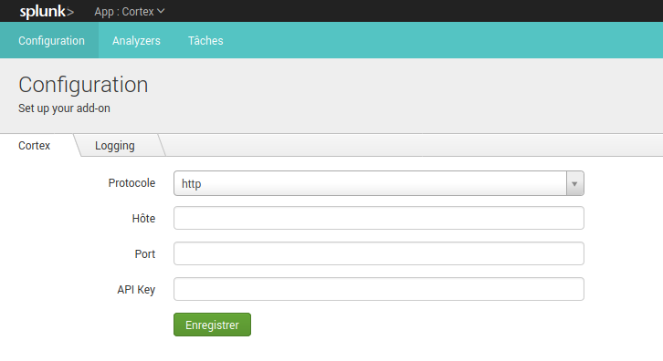

# Introduction
This TA allows to **add interaction features** between [Cortex (TheHive project)](https://thehive-project.org/) and Splunk. It allows to retrieve all tasks in Cortex and to execute new tasks from Splunk, from a search or from a predefined dashboard.
All data types work with the exception of "file" because Splunk does not allow to send a file easily.

**Note**:
It's working using Python3 with the official cortex4api library included.
**A support was added to use Python2**. This is not an official library, it's a syntactically-revised version.
In other words, **it's working for Splunk 7.2 and higher versions**.

# What is Cortex ?
If you need more information about TheHive/Cortex project, please [follow this link](https://thehive-project.org/).
You can find the related [Github here](https://github.com/TheHive-Project/Cortex).

# Use Cases
The objective is to interface a SIEM tool such as Splunk in order to be able to perform automated tasks on IOCs.
This TA has been designed in such a way that :
* You can retrieve information from Cortex about the different tasks that are being performed on the scanners.
* You can run new tasks from Splunk in Cortex using the power of Splunk whether in a search or a predefined dashboard.

# Installation
## Requirements
This application contains all the python libraries to work autonomously.

**However**, a predefined dashboard of the application requires the installation of this application : [Status Indicator - Custom Visualization](https://splunkbase.splunk.com/app/3119/)

You should create a specific user and organization in your Cortex instance to interact with Splunk.

## Configure
Once you've downloaded this application, you must configure your Cortex instance :

1. Go to the **Cortex application > Configuration** (in the navigation bar)
2. You need to specify the following settings :

* **Protocol**: Choose "http" or "https"
* **Host**: Hostname/IP of the Cortex instance
* **Port**: Port used by Cortex
* **API Key**: Corresponds to the API key used by the user/organization to be used (the user/organization will be determined automatically by Cortex)

**Note**: You can active a "debug" logging mode to have more information in searches/logs. 

## Refresh the available analyzers
Once you've configured these settings, you can refresh the list of analyzers in the application.

1. Go to the **Cortex application > Analyzers** (in the navigation bar)
2. Click on the **Refresh Analyzers** button on the top-right
3. After a while, a message indicating that "your analyzers have been reloaded" should appear with the current date. You should see the list of analyzers on the search below.

**Note**: Only enabled analyzers will be loaded

These information are stored in Splunk in order to have a mapping between available analyzers and data types.
If you have any trouble, please create an issue.

# Usage
Once the application is configured and the analyzers are retrieved, you have several options for interfacing with Cortex.
## Cortex "Jobs" dashboard
The application integrates a preconfigured dashboard with searches allowing you to easily interface with Cortex.

### History
You can retrieve the history of jobs in Cortex. By default, it's recovering the last 10 jobs.
For each job, you can see :
* **Status**: Current status for the job
* **Data**: Data and datatype for the job
* **Analyzer**: Analyzer used for the job
* **Created At**: Date and time for the creation of the job
* **Start Date**: Date and time for the start of the job (a created job could not be executed immediately)
* **Created by**: User/Organization used to created the job
* **TLP**: TLP specified for the job
* **ID**: ID of the job

**Note: You can click on the link to view the result of the job directly on Cortex** (you should be authenticated to Cortex)

### Run new tasks

## Commands in searches

# Credits
This app was inspired by [this Splunk app](https://splunkbase.splunk.com/app/4380/)

# Licence
This app TA_cortex is licensed under the GNU Lesser General Public License v3.0.

