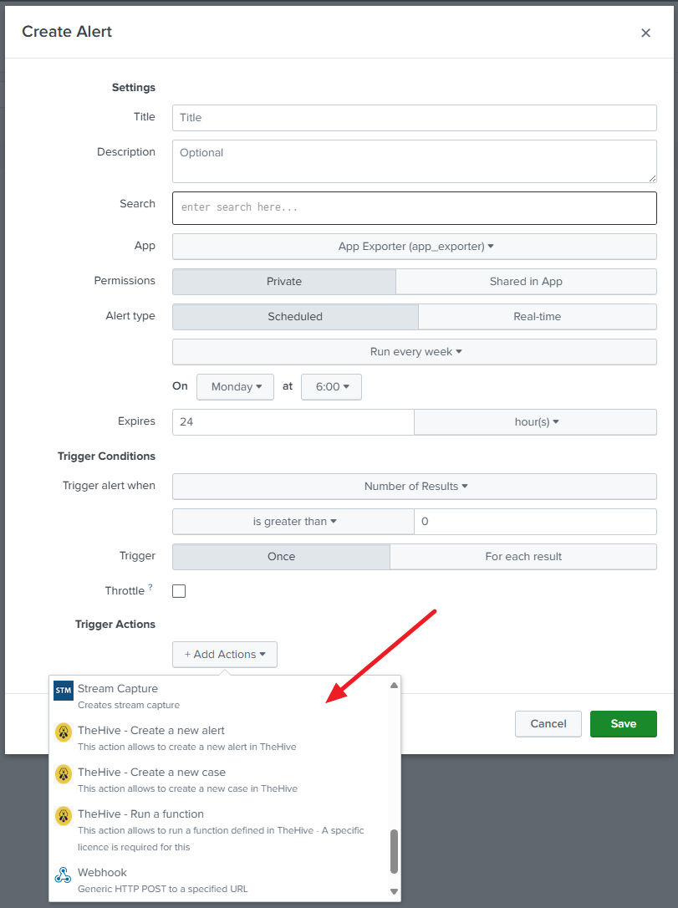
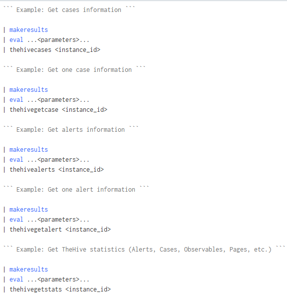
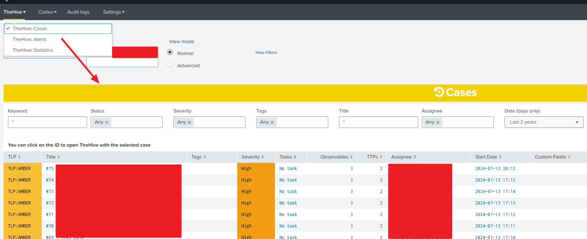

  

# Table of content

- [Table of content](#table-of-content)
- [Introduction](#introduction)
- [What is TheHive/Cortex ?](#what-is-thehivecortex-)
- [Use Cases](#use-cases)
- [Installation](#installation)
- [Configuration (v4.0.0+)](#configuration-v400)
  - [Accounts](#accounts)
  - [Instances](#instances)
  - [Global Settings](#global-settings)
- [Data Collection (Inputs)](#data-collection-inputs)
  - [Sourcetypes](#sourcetypes)
  - [Migration Macros](#migration-macros)
- [Usage](#usage)
  - [Custom alert actions (Splunk Enterprise) and adaptative responses (Splunk Enterprise Security)](#custom-alert-actions-splunk-enterprise-and-adaptative-responses-splunk-enterprise-security)
    - [Fields and datatypes](#fields-and-datatypes)
  - [Commands usable in Splunk searches](#commands-usable-in-splunk-searches)
    - [TheHive Commands](#thehive-commands)
    - [Cortex Commands](#cortex-commands)
  - [Dashboards](#dashboards)
- [Support](#support)
- [Credits](#credits)
- [Licence](#licence)

# Introduction

This Technical Add-on (TA) allows to **add interaction features** between [TheHive or Cortex (StrangeBee)](https://www.strangebee.com/) and Splunk. It allows to retrieve all kind of information from TheHive/Cortex and to perform actions on these instances using Splunk, from a search or from a predefined dashboard.

**Version 4.0.0** introduces a complete architectural migration to the **[Splunk UCC Framework](https://splunk.github.io/addonfactory-ucc-generator/)**, providing a modern, secure, and standardized configuration interface.

- **TheHive Support**: Supporting TheHive 5. (For TheHive 3 or 4, please check legacy releases).
- **Cortex Support**: Supporting Cortex 3.x.
- **Python Requirement**: Optimized for **Python 3.9+** (Splunk Enterprise 9.x+).

# What is TheHive/Cortex ?

If you need more information about TheHive/Cortex project, please [follow this link](https://www.strangebee.com/).
You can find the related [TheHive Project here](https://github.com/TheHive-Project) (including Cortex).

# Use Cases

The objective is to interface a SIEM tool such as Splunk in order to be able to perform automated tasks on observables/IOCs or TTPs.
This TA has been designed in such a way that :

- **Data Pull**: Periodically retrieve events (Cases, Alerts, Observables, Tasks, Audit Logs) from TheHive.
- **Interaction**: Manually query data or trigger actions using custom search commands and dedicated dashboards.
- **Automation**: Automatically create alerts, cases, add observables, add timeline events, or run Cortex jobs/TheHive functions as Splunk Alert Actions or Adaptive Responses.
- **Enterprise Security**: Native integration with Splunk ES via Adaptive Responses.
- **Cortex Jobs**: Monitor and trigger Cortex jobs directly from Splunk.

# Installation

See the [Installation guide](./docs/installation.md). 
**Note for v4.0.0 migration**: This version is a breaking change. Legacy configurations must be re-created via the new UI.

# Configuration (v4.0.0+)

The application now uses a centralized configuration interface under the **Configuration** menu.

## Accounts
Securely store your credentials (API Keys or User/Password) using Splunk's standard **Storage Passwords**. 
1. Navigate to *Configuration > Accounts*.
2. Add a new account for each TheHive or Cortex user/API key.

## Instances
Define your server endpoints and link them to the appropriate Account.
1. Navigate to *Configuration > Instances*.
2. Provide the server URL (HTTPS is mandatory).
3. **SSL Management**: You can reference a custom CA bundle (PEM format) placed in the app's `local/` folder if you use self-signed certificates.

## Global Settings
Configure proxy settings and logging levels in the *Configuration > Settings* tab.

# Data Collection (Inputs)

Inputs are now managed through a dedicated **Inputs** page.

- **Regular Collection**: Scheduled inputs to periodically fetch new data.
- **Backfill (One-shot)**: Dedicated inputs to recover historical data by specifying a date/time range.

## Sourcetypes
Sourcetypes have been normalized in v4.0.0 for better consistency. The new naming convention follows the pattern `thehive:<entity>:<action/metadata>`.

| Entity | New Sourcetypes |
| :--- | :--- |
| **Cases** | `thehive:cases:createdAt`, `thehive:cases:updatedAt`, `thehive:cases:startDate` |
| **Alerts** | `thehive:alerts:createdAt`, `thehive:alerts:updatedAt`, `thehive:alerts:occuredDate` |
| **Observables** | `thehive:observables:createdAt`, `thehive:observables:updatedAt` |
| **Audit Logs** | `thehive:audit` |
| **Tasks (dedicated input)** | `thehive:tasks` |
| **Tasks (linked to Cases)** | `thehive:cases:tasks:createdAt`, `thehive:cases:tasks:updatedAt`, `thehive:cases:tasks:startDate` |
| **Timeline** | `thehive:timeline` |
| **Instance Status** | `thehive:status` |

## Migration Macros
To ensure continuity with historical data and simplify searches across both legacy (v3.9.0) and new (v4.0.0) sourcetypes, the following **macros** are provided:

| Entity | Migration Macro | Included Sourcetypes (Legacy & New) |
| :--- | :--- | :--- |
| **Cases** | `` `thehive_cases` `` | `thehive:last_created:cases`, `thehive:last_updated:cases`, `thehive:cases:*` |
| **Alerts** | `` `thehive_alerts` `` | `thehive:last_created:alerts`, `thehive:last_updated:alerts`, `thehive:alerts:*` |
| **Observables** | `` `thehive_observables` `` | `thehive:last_created:observables`, `thehive:last_updated:observables`, `thehive:observables:*` |
| **Audit Logs** | `` `thehive_audit` `` | `thehive:last_created:audit`, `thehive:audit` |
| **Tasks** | `` `thehive_tasks` `` | `thehive:last_created:case_tasks`, `thehive:last_updated:case_tasks`, `thehive:tasks:*` |

# Usage

## Custom alert actions (Splunk Enterprise) and adaptative responses (Splunk Enterprise Security)

*(Note: Visuals represent the latest UCC interface)*

See the [Alert actions adaptative responses guide](./docs/alert_actions_and_adaptive_responses.md).

### Fields and datatypes

Alert actions use a lookup table (`thehive_datatypes.csv`) to identify supported fields as TheHive datatypes. If missing, the first action will attempt to create it with default values from your TheHive instance.

## Commands usable in Splunk searches

This TA provides several custom search commands to interact with TheHive and Cortex directly from Splunk. Every command requires an `instance_id` (or uses the default one) to specify the target instance.

### TheHive Commands
- `thehivecases`: Retrieve cases from TheHive based on filters (status, severity, tags, etc.).
- `thehivegetcase`: Get details for a specific case by its number.
- `thehivegetalertsfromcase`: Retrieve all alerts associated with a specific case.
- `thehivealerts`: Search and retrieve alerts from TheHive.
- `thehivegetalert`: Get details for a specific alert by its ID.
- `thehivegetstats`: Generate statistics and data for dashboards (similar to TheHive's native dashboards).

### Cortex Commands
- `cortexjobs`: Search and retrieve history of jobs run on Cortex.
- `cortexrun`: Trigger new analyzer jobs in Cortex for specific observables.

For detailed parameters and examples, see the [Commands guide](./docs/commands.md).

## Dashboards

See the [Dashboards guide](./docs/dashboards.md).

# Support

Please [open an issue on GitHub](https://github.com/LetMeR00t/TA-thehive-cortex/issues) if you'd like to report a bug or request a feature.

# Credits

This app was inspired by [this Splunk app](https://splunkbase.splunk.com/app/4380/)

# Licence

This app TA_cortex is licensed under the GNU Lesser General Public License v3.0.
