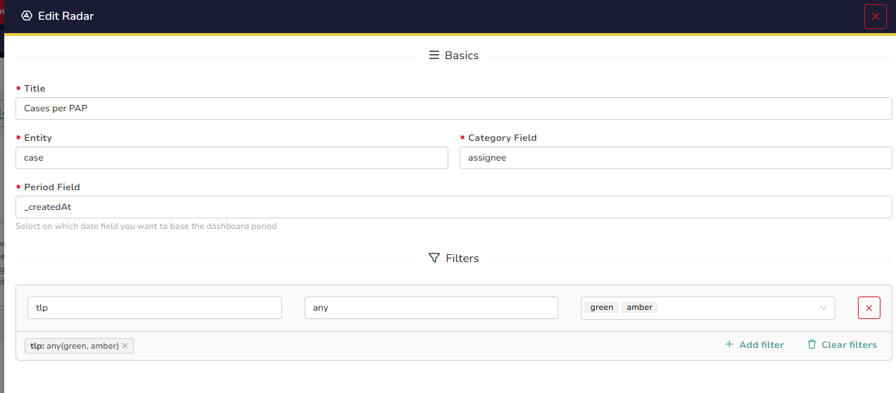

# Commands
This application allows you to use new commands related to TheHive/Cortex.
Every command requires an "Instance ID" parameter which is used to specify which instance needs to be used by the script.

- [Commands](#commands)
- [TheHive](#thehive)
	- [thehivecases](#thehivecases)
		- [Parameters (input results)](#parameters-input-results)
		- [Return](#return)
		- [Examples](#examples)
	- [thehivegetcase](#thehivegetcase)
		- [Parameters (input results)](#parameters-input-results-1)
		- [Return](#return-1)
		- [Examples](#examples-1)
	- [thehivealerts](#thehivealerts)
		- [Parameters (input results)](#parameters-input-results-2)
		- [Return](#return-2)
		- [Examples](#examples-2)
	- [thehivegetalert](#thehivegetalert)
		- [Parameters (input results)](#parameters-input-results-3)
		- [Return](#return-3)
		- [Examples](#examples-3)
	- [thehivegetstats](#thehivegetstats)
		- [Parameters (input results)](#parameters-input-results-4)
		- [Return](#return-4)
		- [Examples](#examples-4)
- [Cortex](#cortex)
	- [cortexjobs](#cortexjobs)
		- [Parameters (input results)](#parameters-input-results-5)
		- [Return](#return-5)
		- [Examples](#examples-5)
	- [cortexrun](#cortexrun)
		- [Parameters (input results)](#parameters-input-results-6)
		- [Return](#return-6)
		- [Examples](#examples-6)


# TheHive

## thehivecases

This command is used to get cases from TheHive (\$..\$ are tokens examples but you can use it directly in your searches).


### Parameters (input results)
One row will result in executing the script one time. So if you specify 5 rows, the script will be executed 5 times and all results will be appended.
If not set, no filter will be applied.

* (Optional) **keyword**: Filter on a specific keyword (Default: *)
* (Optional) **status**: Filter on a specific status (separated by ";") (Default: *)
* (Optional) **severity**: Filter on a specific severity (separated by ";") (Default: *)
* (Optional) **tags**: Filter on a specific tags (separated by ";") (Default: *)
* (Optional) **title**: Filter on a specific title (Default: *)
* (Optional) **assignee**: Filter on a specific assignee (separated by ";") (Default: *)
* (Optional) **date**: Filter on a specific date using the format "\$date1\$ TO \$date2\$" (Default: *)
* (Optional) **max_cases**: The maximum number of cases to return (Default: 100 or your own default)
* (Optional) **sort_cases**: The way how your cases are sorted (Default: "-startDate" or your own default)

**Note**: These parameters are the **expected fields name**.

### Return
This command append new fields per row to previous results.
Every new field will start with "thehive_*". As an exemple, you can recover:

 - thehive_case_caseId
 - thehive_case_createdAt
 - thehive_case_createdBy
 - thehive_case_customFields
 - thehive_case_description
 - thehive_case_endDate
 - thehive_case_flag
 - thehive_case_id
 - thehive_case_impactStatus
 - thehive_case_metrics
 - thehive_case_observables
 - thehive_case_owner
 - thehive_case_pap
 - thehive_case_resolutionStatus
 - thehive_case_severity
 - thehive_case_startDate
 - thehive_case_status
 - thehive_case_summary
 - thehive_case_tags
 - thehive_case_tasks

### Examples
```spl
| makeresults count=1
| thehivecases $$INSTANCE_ID$$
	# This will recover any case
```
```spl
| makeresults count=1
| eval keyword = "github.com" 
| thehivecases $$INSTANCE_ID$$
	# This will recover any case concerning the keyword "github.com"
```
```spl
| makeresults count=1
| eval status = "Open"
| thehivecases $$INSTANCE_ID$$
	# This will recover any "Open" case
```
```spl
| makeresults count=1
| eval status = "Open;Resolved"
| thehivecases $$INSTANCE_ID$$
	# This will recover any "Open" or "Resolved" case
```

## thehivegetcase

This command is used to get a specific from TheHive (\$..\$ are tokens examples but you can use it directly in your searches).

```spl
| makeresults
| eval case_number = "$case_number$"
| thehivegetcase $$INSTANCE_ID$$
```

### Parameters (input results)

* **case_number**: Case number to recover (with or without the "#")

### Return
This command append new fields per row to previous results.
Every new field will start with "thehive_*". As an exemple, you can recover:

 - thehive_case_caseId
 - thehive_case_createdAt
 - thehive_case_createdBy
 - thehive_case_customFields
 - thehive_case_description
 - thehive_case_endDate
 - thehive_case_flag
 - thehive_case_id
 - thehive_case_impactStatus
 - thehive_case_metrics
 - thehive_case_observables
 - thehive_case_owner
 - thehive_case_pap
 - thehive_case_resolutionStatus
 - thehive_case_severity
 - thehive_case_startDate
 - thehive_case_status
 - thehive_case_summary
 - thehive_case_tags
 - thehive_case_tasks

### Examples
```spl
| makeresults
| eval case_number = "#63"
| thehivegetcase $$INSTANCE_ID$$
```

## thehivealerts

This command is used to get alerts from TheHive (\$..\$ are tokens examples but you can use it directly in your searches).

```spl
| makeresults
| eval type = "$filter_type$", severity = "$filter_severity$", tags = "$filter_tags$", title = "$filter_title$", read = "$filter_read$", source = "$filter_source$", date = "$filter_date_d1$ TO $filter_date_d2$", max_alerts="$max_alerts$", sort_alerts="$sort_alerts$"
| thehivealerts $$INSTANCE_ID$$
```

### Parameters (input results)
One row will result in executing the script one time. So if you specify 5 rows, the script will be executed 5 times and all results will be appended.
If not set, no filter will be applied.

* (Optional) **type**: Filter on a specific type (Default: *)
* (Optional) **severity**: Filter on a specific severity (separated by ";") (Default: *)
* (Optional) **tags**: Filter on a specific tags (separated by ";") (Default: *)
* (Optional) **title**: Filter on a specific title (Default: *)
* (Optional) **read**: Filter on a specific read status (Default: *)
* (Optional) **source**: Filter on a specific source (Default: *)
* (Optional) **date**: Filter on a specific date using the format "\$date1\$ TO \$date2\$" (Default: *)
* (Optional) **max_alerts**: The maximum number of alerts to return (Default: 100 or your own default)
* (Optional) **sort_alerts**: The way how your alerts are sorted (Default: "-date" or your own default)

**Note**: These parameters are the **expected fields name**.

### Return
This command append new fields per row to previous results.
Every new field will start with "thehive_*". As an exemple, you can recover:

- thehive_alert_artifacts
- thehive_alert_case
- thehive_alert_caseTemplate
- thehive_alert_createdAt
- thehive_alert_createdBy
- thehive_alert_customFields
- thehive_alert_date
- thehive_alert_description
- thehive_alert_externalLink
- thehive_alert_follow
- thehive_alert_id
- thehive_alert_pap
- thehive_alert_severity
- thehive_alert_similarCases
- thehive_alert_source
- thehive_alert_sourceRef
- thehive_alert_status
- thehive_alert_tags
- thehive_alert_title
- thehive_alert_tlp
- thehive_alert_type
- thehive_alert_updatedAt
- thehive_alert_updatedBy

### Examples

```spl
| makeresults count=1
| thehivealerts $$INSTANCE_ID$$
	# This will recover any alert
```
```spl
| makeresults count=1
| eval source = "splunk" 
| thehivealerts $$INSTANCE_ID$$
	# This will recover any alert concerning with the source set to "splunk"
```
```spl
| makeresults count=1
| eval read = "1"
| thehivealerts $$INSTANCE_ID$$
	# This will recover any already read alert
```
```spl
| makeresults count=1
| eval tags = "t1;t2"
| thehivealerts $$INSTANCE_ID$$
	# This will recover any alert with "t1" or "t2" tag
```

## thehivegetalert

This command is used to get one specific alert from TheHive (\$..\$ are tokens examples but you can use it directly in your searches).

```spl
| makeresults
| eval alert_id = "$alert_id$"
| thehivealerts $$INSTANCE_ID$$
```

### Parameters (input results)

* **alert_id**: Alert ID to recover (with or without the "~")

### Return
This command append new fields per row to previous results.
Every new field will start with "thehive_*". As an exemple, you can recover:

- thehive_alert_artifacts
- thehive_alert_case
- thehive_alert_caseTemplate
- thehive_alert_createdAt
- thehive_alert_createdBy
- thehive_alert_customFields
- thehive_alert_date
- thehive_alert_description
- thehive_alert_externalLink
- thehive_alert_follow
- thehive_alert_id
- thehive_alert_pap
- thehive_alert_severity
- thehive_alert_similarCases
- thehive_alert_source
- thehive_alert_sourceRef
- thehive_alert_status
- thehive_alert_tags
- thehive_alert_title
- thehive_alert_tlp
- thehive_alert_type
- thehive_alert_updatedAt
- thehive_alert_updatedBy

### Examples

```spl
| makeresults
| eval alert_id = "~573685784"
| thehivegetalert $$INSTANCE_ID$$
```

## thehivegetstats

This command is used to get statistics from TheHive generally used in dashboards (\$..\$ are tokens examples but you can use it directly in your searches).

```spl
| makeresults
| eval model="$model$", field="$field$"(, _createdAt = "$date$") (, _updatedAt = "$date$") (, filtered_field = "$filtered_field$", filtered_condition = "$filtered_condition$", filtered_values =  "$filtered_values$")
| thehivegetstats $$INSTANCE_ID$$
```

### Parameters (input results)
One row will result in executing the script one time. So if you specify 5 rows, the script will be executed 5 times and all results will be appended.
If not set, no filter will be applied.

Those parameters are based on what can be set on TheHive dashboards:


* **model**: Indicates which "Entity" shall be used
* **field**: Indicates which "Category Field" shall be used
* (Optional) **_createdAt**: Indicates which period of time shall be considered to filter on the created date (which is the "Period Field" on TheHive)
* (Optional) **_updatedAt**: Indicates which period of time shall be considered to filter on the updated date (which is the "Period Field" on TheHive)
* (Optional) **filtered_field**: Indicates the field to filter on
* (Optional) **filtered_condition**: Indicates the condition to filter on
* (Optional) **filtered_values**: Indicates the values to filter on

> Note: Only one filter is allowed for the Splunk command

**Note**: These parameters are the **expected fields name**.

### Return
This command append new fields per row to previous results.
Every new field will start with "thehive_*". As an exemple, you can recover:

 - &lt;field&gt; (the name of the field you selected with the list of values (one per raw))
 - count

### Examples

```spl
| makeresults
| eval model="Case", field="assignee", _createdAt = "* TO *"
| thehivegetstats $$INSTANCE_ID$$
	# This will recover statistics for all cases on the field assignee (no filter)
```
```spl
| makeresults
| eval model="Case", field="assignee", _createdAt = "* TO *" , filtered_field = "tlp", filtered_condition = "any", filtered_values =  "1;2"
| thehivegetstats $$INSTANCE_ID$$
	# This will recover statistics for all cases on the field assignee by filtering on the cases having a TLP set to GREEN or AMBER
```
```spl
| makeresults
| eval model="Observable", field="tlp"
| thehivegetstats $$INSTANCE_ID$$
	# This will recover statistics for all observables on the field tlp
```
```spl
| makeresults
| eval model="Procedure", field="tactic", _createdAt = "1672527600000 TO 1704150000000" 
| thehivegetstats $$INSTANCE_ID$$
	# This will recover statistics for all TTPs on the field tactic that were identified in 2023
```

# Cortex

## cortexjobs

This command is used to get jobs from Cortex (\$..\$ are tokens examples but you can use it directly in your searches).


| makeresults
| eval data = "$filter_data$", datatypes = "$filter_datatypes$", analyzers = "$filter_analyzers$", max_jobs="$max_jobs$", sort_jobs="$sort_jobs$"
| cortexjobs $$INSTANCE_ID$$

### Parameters (input results)
One row will result in executing the script one time. So if you specify 5 rows, the script will be executed 5 times and all results will be appended.
If not set, no filter will be applied on the jobs history.

* (Optional) **data**: Specify an exact match string for the data (Default: *)
* (Optional) **datatypes**: A list of data types to search for separated by a semicolon (Default: *)
* (Optional) **analyzers**: A list of analyzers name to search for separated by a semicolon (Default: *)
* (Optional) **max_jobs**: The maximum number of jobs to return (Default: 100 or your own default)
* (Optional) **sort_jobs**: The way how your jobs are sorted (Default: "-createdAt" or your own default)

**Note**: These parameters are the **expected fields name**.

### Return
This command append new fields per row to previous results.
Every new field will start with "cortex_*". As an exemple, you can recover:

 - cortex_job_analyzerDefinitionId
 - cortex_job_analyzerId
 - cortex_job_analyzerName
 - cortex_job_cacheTag
 - cortex_job_createdAt
 - cortex_job_createdBy
 - cortex_job_data
 - cortex_job_dataType
 - cortex_job_date
 - cortex_job_id
 - cortex_job_message
 - cortex_job_organization
 - cortex_job_pap
 - cortex_job_parameters
 - cortex_job_status
 - cortex_job_tlp
 - cortex_job_type
 - cortex_job_workerDefinitionId
 - cortex_job_workerId
 - cortex_job_workerName

### Examples

| makeresults count=1
| cortexjobs $$INSTANCE_ID$$
	# This will recover any job
	
| makeresults count=1
| eval data = "github.com" 
| cortexjobs $$INSTANCE_ID$$
	# This will recover any job concerning the exact match "github.com" as data
	
| makeresults count=1
| eval datatypes = "ip"
| cortexjobs $$INSTANCE_ID$$
	# This will recover any job based on an "ip" data type
		 
| makeresults count=1
| eval datatypes = "ip;domain"
| cortexjobs $$INSTANCE_ID$$
	# This will recover any job based on an "ip" or "domain" data type
		
| makeresults count=1
| eval analyzers = "Abuse_Finder_3_0 ;GoogleDNS_resolve_1_0_0" 
| cortexjobs $$INSTANCE_ID$$
	# This will recover any job based on the "Abuse_Finder_3_0" or "GoogleDNS_resolve_1_0_0" analyzers

## cortexrun
This command is used to run new jobs to Cortex (\$..\$ are tokens examples but you can use it directly in your searches).

| makeresults
| eval data = "$data$", dataType = "$dataType$", tlp = "$tlp$", pap = "$pap$", analyzers = "$analyzers$"
| cortexjobs $$INSTANCE_ID$$

### Parameters (input results)

One row will result in executing the script one time. So if you specify 5 rows, the script will be executed 5 times and all results will be appended.

* (Mandatory) **data**: Specify the data to analyze (separated by ";" for the same datatype)
* (Mandatory) **dataType**: Specify the datatype to analyze 
* (Optional) **analyzers**: A list of analyzers name to search for separated by a semicolon (Default: *)
* (Optional) **tlp**: TLP to use for analysis (0=WHITE,1=GREEN,2=AMBER,3=RED) (Default: 2)
* (Optional) **pap**: PAP to use for analysis (0=WHITE,1=GREEN,2=AMBER,3=RED) (Default: 2)

**Note**: These parameters are the **expected fields name**.

### Return

This command append new fields per row to previous results.
Every new field will start with "cortex_*". As an exemple, you can recover:

 - cortex_job_analyzerDefinitionId
 - cortex_job_analyzerId
 - cortex_job_analyzerName
 - cortex_job_cacheTag
 - cortex_job_createdAt
 - cortex_job_createdBy
 - cortex_job_data
 - cortex_job_dataType
 - cortex_job_date
 - cortex_job_id
 - cortex_job_message
 - cortex_job_organization
 - cortex_job_pap
 - cortex_job_parameters
 - cortex_job_status
 - cortex_job_tlp
 - cortex_job_type
 - cortex_job_workerDefinitionId
 - cortex_job_workerId
 - cortex_job_workerName


### Examples


| makeresults
| eval data = "8.8.8.8", dataType = "ip"
| cortexrun $$INSTANCE_ID$$
	# This will start as many jobs as there is available analyzers for the data type "ip" with TLP and PAP level set to AMBER (default)

| makeresults
| eval data = "8.8.8.8;8.8.4.4", dataType = "ip", analyzers = "GoogleDNS_resolve_1_0_0;Abuse_Finder_3_0"
| cortexrun $$INSTANCE_ID$$
	# This will start four jobs (two data and two analyzers) with TLP and PAP level set to AMBER (default)
	 
| makeresults
| eval data = "8.8.8.8;8.8.4.4", dataType = "ip", tlp = "GREEN", pap = "WHITE", analyzers = "GoogleDNS_resolve_1_0_0 ;Abuse_Finder_3_0"
| cortexrun $$INSTANCE_ID$$
	# This will start four jobs (two data and two analyzers) with TLP and PAP level set respectively to GREEN and WHITE

