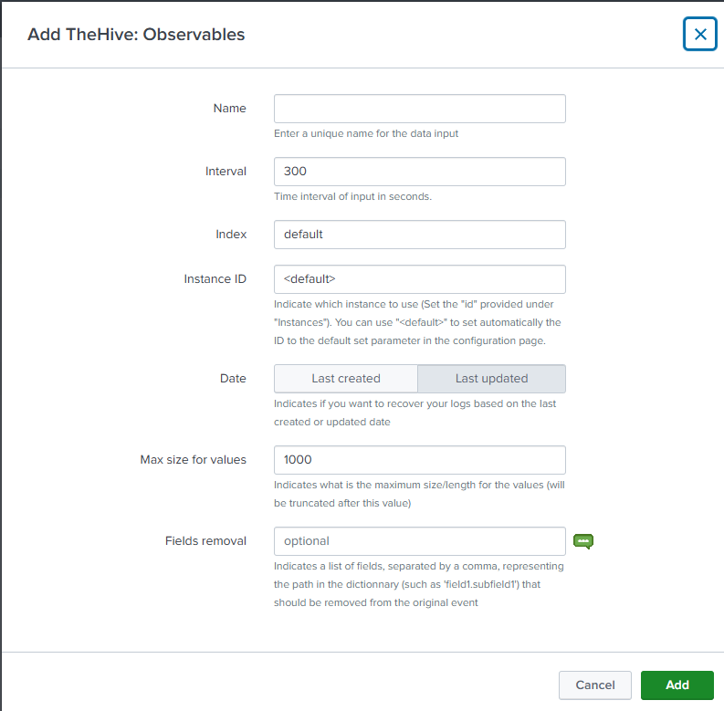

# Installation

## Requirements

This application contains all the python libraries to work autonomously.

You should create a specific user and organization in your TheHive/Cortex instances to interact with Splunk.

> ⚠️ If you were using an old application (such as v2.3.1) and wants to migrate to the last major version (v3.x.x), there is a change with the way how instances are stored into Splunk. It's not using anymore a KVStore but a CSV lookup to do so. Please, follow the below procedure

Before the migration, you should backup your instances information using a:

- `| inputlookup thehive_cortex_instances | outputlookup thehive_cortex_instances_bk.csv`

in another application such as "search", then migrate and finally restore the backup using a:

- `| thehive_cortex_instances_bk.csv | outputlookup thehive_cortex_instances`

## Configuration

Before using the application, you need to set up your environment settings. Please note that this application is using a list of accounts and instances, meaning you can configure several instances of TheHive/Cortex in the same app and with different accounts.

### Accounts

You have to set up your accounts/instances configuration.
An account is used to authenticate to one instance. You have to add every account you need to use and store the API Key as the password (**username/password authentication is only supported for TheHive, not Cortex, we recommand you to use an API key**)

1. Go to the **TheHive/Cortex application > Settings > Configuration** (in the navigation bar)
2. Under **Accounts**, you need to add any account you want to use with TheHive/Cortex

- **Account name**: The name of the account, it will be reused to link an account to an instance.  
- **Username**: The username of this account. For now, it's not used but we recommand you to keep the same name as you have on your instance (TheHive or Cortex)
- **Password**: The password field must be filled with **a valid API key** to use for authentification

*This image is an example of one registered account named "TheHive5_Cloud"*

### TheHive/Cortex instances

Once you've done that, you can configure all your instances. An instance is an endpoint representing a TheHive or Cortex instance.

1. Go to the **TheHive/Cortex application > Settings > Instances** (in the navigation bar)
2. On this dashboard, you need to add every instance you want to use. To do so, select the "**Add a new instance**" as action and fill these fields:

- **Account name (Global accounts)**: This is the name of the account to use that you added under "Accounts". It will list you all available accounts you have previously set up.
- **Authentication type**: Authentication type for your instance. Password is working only with TheHive but we recommand you to use an API key everytime
- **Type**: Type of your instance (TheHive (v3 or v4) or Cortex (v3)).
- **Organisation**: The name of the organisation against which api calls will be run. Default to "-" meaning None.
- **Proxy URL**: A string that indicates what is the proxy URL to use for this instance if there is any. You can specify http/https if you want but the same value will be used for both protocols. Default to "-" meaning None
- **Proxy account**: This is the name of the account to use for the proxy authentication (only basic) that you added under "Accounts". It will list you all available accounts you have previously set up. Default to "None".
- **Client Certificate**: Filename of you client certificate if you need one. This certificate must be placed under "\$APP_FOLDER\$/local" and you just have to set the name of the file here. This certificate will be used during the proxy authentication. Default to "-" meaning None. In the case you would like to do mTLS (Mutual TLS), you can add the public AND private key into the same file and point this file with this field. This certificate can be provided as a base64 encoded certificate through the GUI and will be decoded and stored in a dedicated cert file in the local folder.
- **Host**: Host of your instance (hostname or IP).
- **Port**: Port used by your instance (Default:9000 for TheHive, 9001 for Cortex).
- **URI**: Indicates what is the URI based for your instance. By default, TheHive/Cortex is installed at the root of the server so the URI would be "/". If you are using a Cloud instance, you may have to specify the URI used by your cloud instance. For example, if your TheHive instance is accessible with this URL : "https://my-cloud-website.com:443/mythehiveinstance", then you should specify in the URI field "/mythehiveinstance".

> **Note**: Protocol used by default is HTTPS and can't be modified. Moreover, the certificate verification is mandatory and set to True (below screenshot is not up to date). If you use an HTTPS connection with a self-signed certificate of a custom certificate authority, you must add your trusted certificate to the "certifi" library. To do so, append your certificate under "\$APP_FOLDER\$/bin/ta_thehive_cortex/aob_py3/certifi/cacert.pem"

*This image shows the addition of a new instance (partially filled fields) by specifying an account name defined beforehand.*

On the above example, you can see a list of defined instances:

- The 1st example could be an on-premise instance without any security check
- The 2nd example could be an on-premise instance with a client certificate to use for the authentication to a proxy
- The 3rd example could be a Cloud instance with a custom URI to access the TheHive application but without any certificate check
- The 4th example could be a Cloud instance with a custom URI to access the TheHive application, to a certain organisation and ensuring the certificate check

### Inputs

When your instances are configured, you can set up inputs to collect data from Splunk into TheHive.

> Note: Each input has its sibling "Backfill" which is used to perform the same thing but in the past and in a oneshot way (interval set to '-1'). If you want to collector regurlaly data (every 5 minutes for instance), you shouldn't use the "Backfill" but the regular inputs instead. If you wish to recover data between a start and end date only once, then backfills are used for this purpose.

Three types of inputs are available: Alerts & Cases, Observables and Audit

#### Alerts & Cases

This input is used to collect regular data from Alerts or Cases
You can configure those parameters:

- **Name**: Provide a unique name for your input
- **Interval**: Define the periodicity of the log collection in seconds. Default set to '300' (5 minutes)
- **Index**: Indicates in which index the data will be saved to. Default set to 'default'
- **Instance ID**: Indicates the instance ID to be used to contact TheHive. Default set to '&lt;default&gt;' (be sure to set a default instance ID in the configuration)
- **Type**: Select which kind of objects you want to collect. If you want to collect both, you will have to create two dedicated inputs. Default set to 'Cases'
- **Additional information**: Indicates which kind of data you want to collect on top of the basic data. You can collect 'Tasks', 'Observables', 'Attachments', 'Pages' or 'TTPs'. **Be careful** that adding all the data might end up to have large JSON logs that could be truncated/malformed depending on your Splunk settings.
- **Date**: Indicates if you want to collect those data based on the created or updated date. Default set to 'Last updated'
- **Max size for values**: Indicates the maximum size for each value of the JSON log. This setting can be used to truncate large values (such as the description) to avoid having large values. When applied, a '[trunc]' string will be applied at the limit of the value size. Default set to '1000' (characters)
- **Fields removal**: Indicates if you want to get rid of several keys within the JSON logs. Let's imagine that you have one field that you want to get rid within your logs because it's too large, then you can specify the path in the JSON in this field. The path will be interpreted depending on '.' and '\*' characters. Use '.' to go deeper in the JSON structure and the '\*' if you want to process all elements from a list. Several values can be provided separated by a comma. Example: "description,object.case,context.customFields.*.order" (it will remove the field 'description', the field 'case' within the filed 'object' and the field 'order' in all elements from the list 'customFields' within the 'context' field)

#### Observables

This input is used to collect regular data from Observables
You can configure those parameters:

- **Name**: Provide a unique name for your input
- **Interval**: Define the periodicity of the log collection in seconds. Default set to '300' (5 minutes)
- **Index**: Indicates in which index the data will be saved to. Default set to 'default'
- **Instance ID**: Indicates the instance ID to be used to contact TheHive. Default set to '&lt;default&gt;' (be sure to set a default instance ID in the configuration)
- **Date**: Indicates if you want to collect those data based on the created or updated date. Default set to 'Last updated'
- **Max size for values**: Indicates the maximum size for each value of the JSON log. This setting can be used to truncate large values (such as the description) to avoid having large values. When applied, a '[trunc]' string will be applied at the limit of the value size. Default set to '1000' (characters)
- **Fields removal**: Indicates if you want to get rid of several keys within the JSON logs. Let's imagine that you have one field that you want to get rid within your logs because it's too large, then you can specify the path in the JSON in this field. The path will be interpreted depending on '.' and '\*' characters. Use '.' to go deeper in the JSON structure and the '\*' if you want to process all elements from a list. Several values can be provided separated by a comma. Example: "description,object.case,context.customFields.*.order" (it will remove the field 'description', the field 'case' within the filed 'object' and the field 'order' in all elements from the list 'customFields' within the 'context' field)

#### Audit

This input is used to collect regular data from Audit logs
You can configure those parameters:

- **Name**: Provide a unique name for your input
- **Interval**: Define the periodicity of the log collection in seconds. Default set to '300' (5 minutes)
- **Index**: Indicates in which index the data will be saved to. Default set to 'default'
- **Instance ID**: Indicates the instance ID to be used to contact TheHive. Default set to '&lt;default&gt;' (be sure to set a default instance ID in the configuration)
- **Max size for values**: Indicates the maximum size for each value of the JSON log. This setting can be used to truncate large values (such as the description) to avoid having large values. When applied, a '[trunc]' string will be applied at the limit of the value size. Default set to '1000' (characters)
- **Fields removal**: Indicates if you want to get rid of several keys within the JSON logs. Let's imagine that you have one field that you want to get rid within your logs because it's too large, then you can specify the path in the JSON in this field. The path will be interpreted depending on '.' and '\*' characters. Use '.' to go deeper in the JSON structure and the '\*' if you want to process all elements from a list. Several values can be provided separated by a comma. Example: "description,object.case,context.customFields.*.order" (it will remove the field 'description', the field 'case' within the filed 'object' and the field 'order' in all elements from the list 'customFields' within the 'context' field)

### Logging

You can enable a "debug" logging mode (under **Configuration**) to have more information in searches/logs.
By default, all logging files are created under `$SPLUNK_HOME/var/log/splunk/`

You will be able to have these logs in your search.log too.

## Refreshing the available analyzers

Once you've configured your Cortex instance, the list of analyzers will be loaded in Splunk.
Analyzers must be refreshed using the related dashboard by using the "REFRESH" mode.
Once you've refreshed your analyzers, they will be available in the Cortex dashboard in order to create new jobs.

**Note**: Only enabled analyzers will be loaded

These information are stored in Splunk in order to have a mapping between available analyzers and data types.